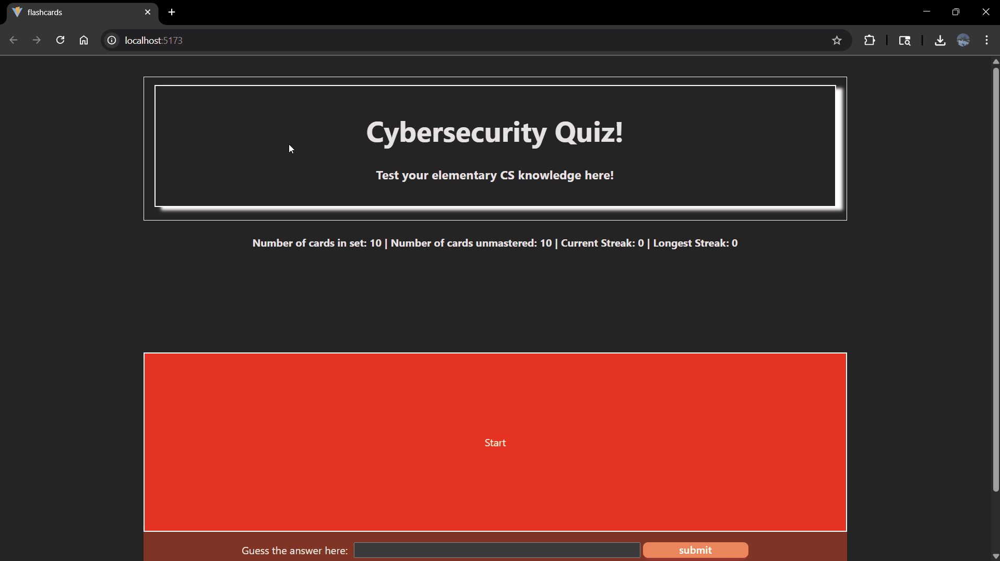
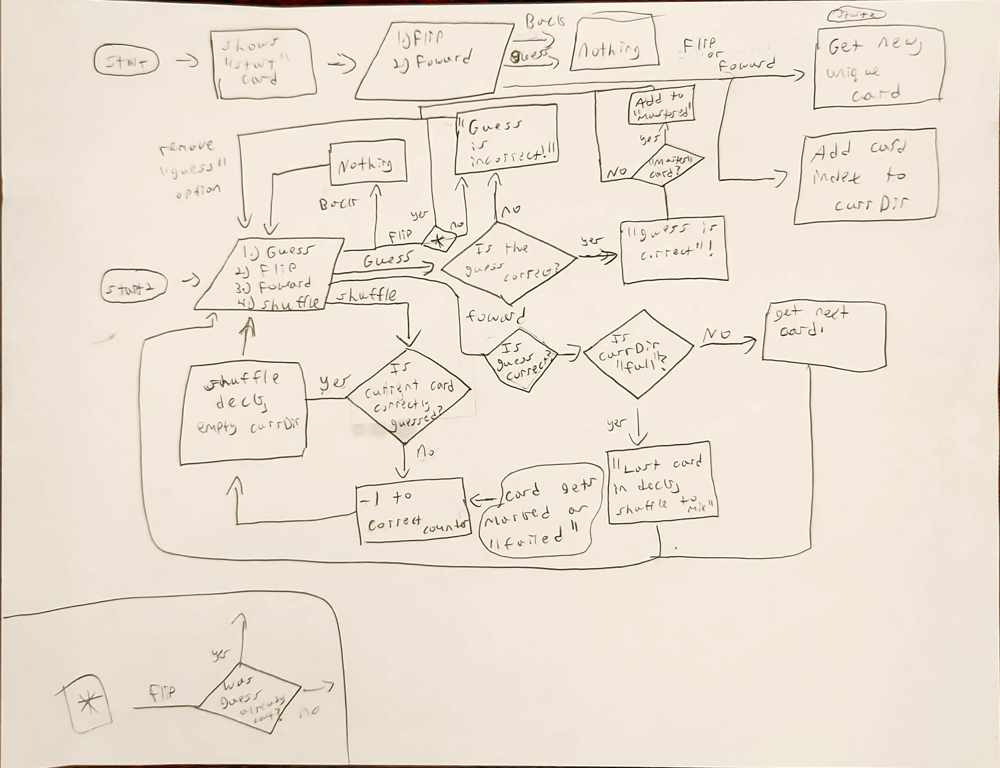

# Web Development Project 3 - Cybersecurity FlashCards!

Submitted by: **Harold Escorcia**

This web app: **Allows users to study a few cybersecurity/IT related flashcards!**

Time spent: **12** hours spent in total

## Required Features

The following **required** functionality is completed:

- [X] **The user can enter their guess into an input box *before* seeing the flipside of the card**
  - Application features a clearly labeled input box with a submit button where users can type in a guess
  - Clicking on the submit button with an **incorrect** answer shows visual feedback that it is wrong 
  -  Clicking on the submit button with a **correct** answer shows visual feedback that it is correct
- [X] **The user can navigate through an ordered list of cardss**
  - A forward/next button displayed on the card navigates to the next card in a set sequence when clicked
  - A previous/back button displayed on the card returns to the previous card in the set sequence when clicked
  - Both the next and back buttons should have some visual indication that the user is at the beginning or end of the list (for example, graying out and no longer being available to click), not allowing for wrap-around navigation

The following **optional** features are implemented:

- [X] Users can use a shuffle button to randomize the order of the cards
  - Cards should remain in the same sequence (**NOT** randomized) unless the shuffle button is clicked 
  - Cards should change to a random sequence once the shuffle button is clicked
- [] A user’s answer may be counted as correct even when it is slightly different from the target answer
  - Answers are considered correct even if they only partially match the answer on the card 
  - Examples: ignoring uppercase/lowercase discrepancies, ignoring punctuation discrepancies, matching only for a particular part of the answer rather than the whole answer
- [X] A counter displays the user’s current and longest streak of correct responses
  - The current counter increments when a user guesses an answer correctly
  - The current counter resets to 0 when a user guesses an answer incorrectly
  - A separate counter tracks the longest streak, updating if the value of the current streak counter exceeds the value of the longest streak counter 
- [X] A user can mark a card that they have mastered and have it removed from the pool of displayed cards
  - The user can mark a card to indicate that it has been mastered
  - Mastered cards are removed from the pool of displayed cards and added to a list of mastered cards

The following **additional** features are implemented:

* [X] Users can only guess once! If they get it wrong or right, that card is permanently marked until deck is shuffled.

## Video Walkthrough

Here's a walkthrough of implemented user features:

GIF created with ScreenToGIF!

## Notes

1. Fortunately, I did not have many problems with this site! I ended up taking a more relaxed approach where I built logic functions one by one and used a (albeit incomplete) flowchart to better decide which functions to make first. The benefit of this approach was that even when I wanted to be lazy and just write code without planning in advance, the functions I'd already planned out was modular enough for me to not have much issue adding new stretch features since there was a clear line between functions and what data they handled. 
I had to completely restructure my original logic because my previous one worked completely differently and did not align with the required features of this project. Here is the rough flowchart I used: 

2. The only real problem I had was with the optional feature to count certain answers as correct even if only partially so. The problem is that my flashcards just don't work that way, I could've probably implemented a solution that broke the input into an array and then compared each string with the answers for the given flashcard, but it just doesn't seem right since my flashcards are mostly made up of acronyms and I'd have to consider cases like "not xyz" and that seemed like a bit much. 

## License

    Copyright 2025 Harold Escorcia

    Licensed under the Apache License, Version 2.0 (the "License");
    you may not use this file except in compliance with the License.
    You may obtain a copy of the License at

        http://www.apache.org/licenses/LICENSE-2.0

    Unless required by applicable law or agreed to in writing, software
    distributed under the License is distributed on an "AS IS" BASIS,
    WITHOUT WARRANTIES OR CONDITIONS OF ANY KIND, either express or implied.
    See the License for the specific language governing permissions and
    limitations under the License.