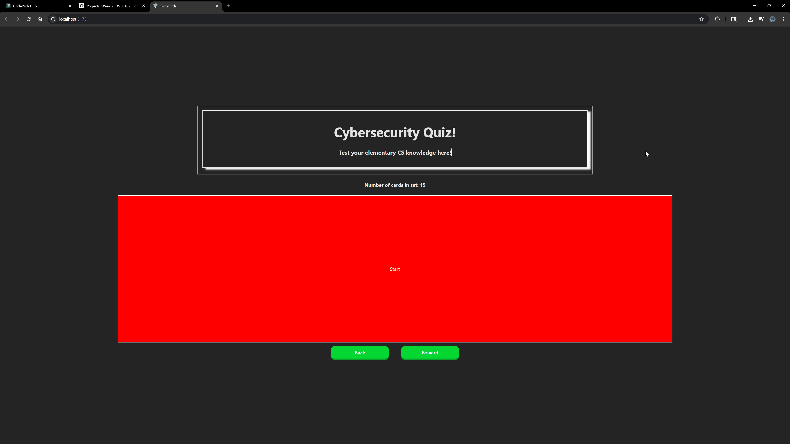

# Web Development Project 2 - Cybersecurity Quiz

Submitted by: Harold Escorcia

This web app: Has multiple flashcards from a personal stack that I used to study for the SOCOA 1 certification by BCR cyber!

Time spent: 18 hours spent in total

## Required Features

The following **required** functionality is completed:

- [X] **The app displays the title of the card set, a short description, and the total number of cards**
  - [X] Title of card set is displayed 
  - [X] A short description of the card set is displayed 
  - [X] A list of card pairs is created
  - [X] The total number of cards in the set is displayed 
  - [X] Card set is represented as a list of card pairs (an array of dictionaries where each dictionary contains the question and answer is perfectly fine)
- [X] **A single card at a time is displayed**
  - [X] Only one half of the information pair is displayed at a time
- [X] **Clicking on the card flips the card over, showing the corresponding component of the information pair**
  - [X] Clicking on a card flips it over, showing the back with corresponding information 
  - [X] Clicking on a flipped card again flips it back, showing the front
- [X] **Clicking on the next button displays a random new card**

The following **optional** features are implemented:

- [ ] Cards contain images in addition to or in place of text
  - [ ] Some or all cards have images in place of or in addition to text
- [ ] Cards have different visual styles such as color based on their category
  - Example categories you can use:
    - Difficulty: Easy/medium/hard
    - Subject: Biology/Chemistry/Physics/Earth science

The following **additional** features are implemented:

* [X] "Flashcard Memory" , you can continually foward through cards and ALSO backtrack through EVERY card seen up to that point! 

## Video Walkthrough

Here's a walkthrough of implemented required features:

GIF created with ScreenToGif

## Notes

Describe any challenges encountered while building the app.

1. This is written roughly 3 hours in. I spent most of that time trying to figure out how to flip the flash card. Note to self: Just google how to do it yourself next time. The real challenge there was just trying to figure out why the transition wouldn't play which was because I originally had the component be the entire card itself rather than just the text. So react would replace the entire element with the new one when I used the useState() method to apply .flip to the card. Thus the transition didn't play since the value of transform technically didn't change. I'm gonna try to finish this project faster instead of getting lost like last time. 

2. This is written after I finished. Roughly 8-10 hours in I realized that I did not know what I made or how it worked. So I started over (the card swapping logic that is) and instead meticulously added comments to almost everything I wrote to make sure I never got lost. Its definitely noticeable but helped a lot and I generally had an easier time figuring out what was wrong when things do go wrong. I'm definitely going to plan things out a lot more in future projects  

3. Writing the "SwapCard()" logic was a HUGE pain. I had to write a ton of comments to remind myself of just what it SHOULD do as I kept forgetting and got lost. I eventually had to split part of "SwapCard()" into "GetNextCard()" to make things easier to understand. Fortunately, I think I did a decent job with naming functions and useStates so that wasn't an issue. This project reminded me to more meticulously plan things out, as I'm sure I could've done more in less time. 

## License

    Copyright 2025 Harold Escorcia

    Licensed under the Apache License, Version 2.0 (the "License");
    you may not use this file except in compliance with the License.
    You may obtain a copy of the License at

        http://www.apache.org/licenses/LICENSE-2.0

    Unless required by applicable law or agreed to in writing, software
    distributed under the License is distributed on an "AS IS" BASIS,
    WITHOUT WARRANTIES OR CONDITIONS OF ANY KIND, either express or implied.
    See the License for the specific language governing permissions and
    limitations under the License.